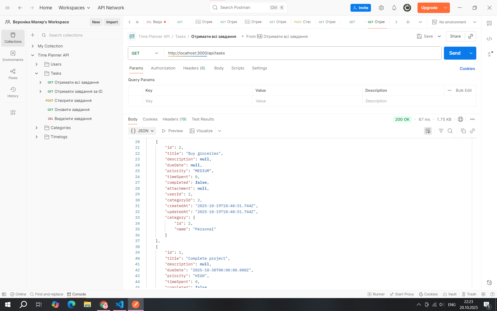

# Звіт з лабораторної роботи 1

## Тема роботи: Розроблення backend архітектури та основного функціоналу

Здобувач освіти: Маляр Вероніка Володимирівна
Група: ІПЗ-42
GitHub репозиторій: https://github.com/veronikamaliar/timeplanner-app.git

## Виконання роботи

### Налаштування проєкту
- Створено Git репозиторій
- Ініціалізовано Node.js проєкт
- Встановлено необхідні залежності
- Налаштовано структуру папок: src/controllers/, src/models/, src/routes/, src/utils/, prisma/

### База даних
- Налаштовано PostgreSQL та підключення через .env
- Створено Prisma схему для моделей з необхідними полями
- Виконано міграцію бази даних

### Backend архітектура
- Створено Express.js сервер (src/app.js) з налаштуванням middleware.
- Реалізовано MVC архітектуру (контролери, моделі, маршрути).
- Впроваджено middleware для обробки запитів, валідації даних та помилок

### API endpoints

#### Users
- GET /api/users — отримати всіх користувачів
- GET /api/users/:id — отримати користувача за ID
- POST /api/users — створити нового користувача
- PUT /api/users/:id — оновити дані користувача
- DELETE /api/users/:id — видалити користувача

#### Tasks
- GET /api/tasks — отримати всі завдання
- GET /api/tasks/:id — отримати завдання за ID
- POST /api/tasks — створити нове завдання
- PUT /api/tasks/:id — оновити завдання
- DELETE /api/tasks/:id — видалити завдання

#### Categories
- GET /api/categories — отримати всі категорії
- GET /api/categories/:id — отримати категорію за ID
- POST /api/categories — створити нову категорію
- PUT /api/categories/:id — оновити категорію
- DELETE /api/categories/:id — видалити категорію

#### Timelogs
- GET /api/timelogs — отримати всі записи часу
- GET /api/timelogs/:id — отримати запис часу за ID
- POST /api/timelogs — створити новий запис часу
- PUT /api/timelogs/:id — оновити запис часу
- DELETE /api/timelogs/:id — видалити запис часу

## Структура проєкту

```
timeplanner-app/
├── prisma/
│   ├── migrations/           
│   ├── schema.prisma         
│   └── seed.js             
│
├── src/
│   ├── controllers/           
│   │   ├── userController.js
│   │   ├── taskController.js
│   │   ├── categoryController.js
│   │   └── timelogController.js
│   │
│   ├── middleware/           
│   │   └── errorHandler.js
│   │
│   ├── models/                
│   │ 
│   ├── routes/                
│   │   ├── users.js
│   │   ├── tasks.js
│   │   ├── categories.js
│   │   └── timelogs.js
│   │
│   ├── utils/                 
│   │
│   └── app.js              
│
├── .env                      
├── .gitignore                
├── package.json               
├── package-lock.json         
├── API_DOCUMENTATION.md  
|     
├── reports/
    └── lab1-report.md           

```

## Скріншоти тестування





## Висновки

Самооцінка: 5

Обгрунтування: виконано всі завдання лабораторної роботи, реалізована повна валідація даних та обробка помилок і створена документація API
